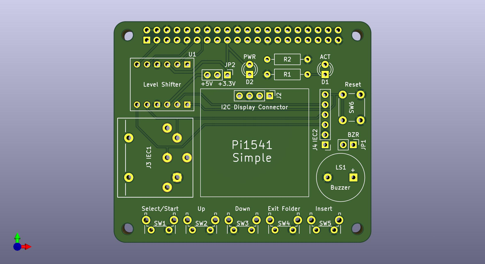
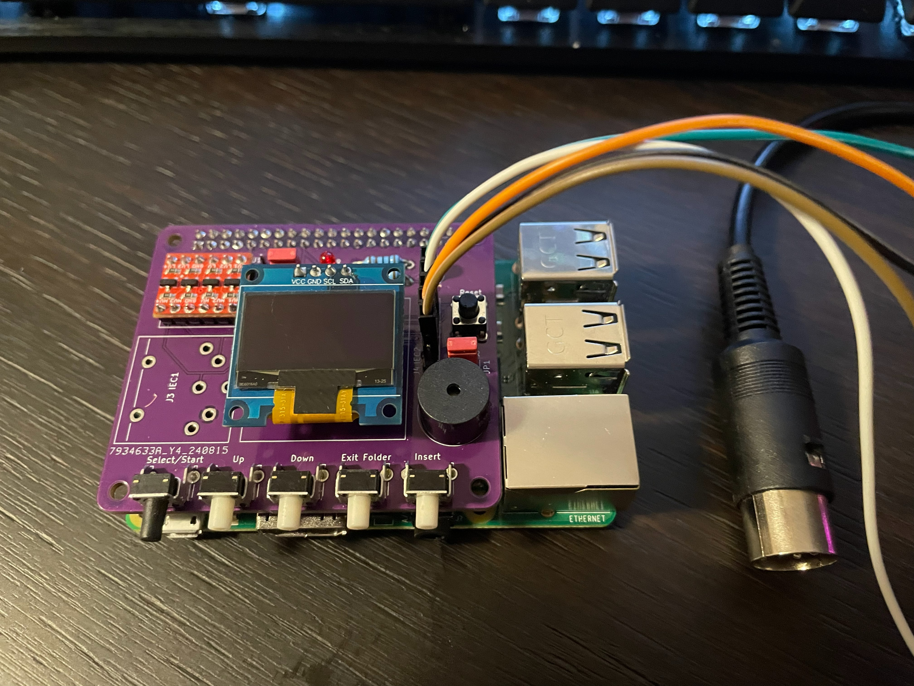

# Pi1541-Simple-HAT

An open-source Raspberry Pi HAT for the [Pi1541](https://github.com/pi1541/Pi1541) project — a cycle-exact emulator of the Commodore 1541 floppy disk drive. This board provides a clean, simple way to build a standalone Pi1541 unit with buttons, display, buzzer, and IEC connectivity, without needing to hand-wire everything on a breadboard.

---

## Overview

Pi1541 turns a Raspberry Pi into a hardware-accurate 1541 emulator that loads `.d64`, `.g64`, `.nib`, and other disk image formats from an SD card. This HAT breaks out everything you need onto a single board that sits directly on top of a Raspberry Pi 3B+.

The design is intentionally minimal — no SMD components beyond the connectors and passives, uses a widely available logic level converter module, and gives you flexibility on the IEC connector (DIN-6 socket or plain pin header, your choice).

---

## Features

- Designed as a standard 40-pin Raspberry Pi HAT
- Bidirectional logic level shifting (3.3V ↔ 5V) for the IEC bus
- Two IEC footprints: DIN-6 connector **or** pin header — populate whichever suits your build
- I2C connector for SSD1306 128×64 OLED display
- 5 navigation buttons: Select/Start, Up, Down, Exit Folder, Insert
- Reset button
- PWR and ACT indicator LEDs with current-limiting resistors
- Passive buzzer with enable/disable jumper (JP1)
- Voltage selector jumper (JP2): +5V or +3.3V for the display
- 4 mounting holes

---

## Hardware

### Bill of Materials

| Ref | Qty | Component | Description |
|-----|-----|-----------|-------------|
| U1 | 1 | SparkFun BOB-12009 (or equivalent) | Bidirectional logic level converter, BSS138-based, 4-channel |
| J1 | 1 | 40-pin female GPIO header | Standard 2.54mm pitch Raspberry Pi header |
| J3 | 1 | DIN-6 female socket **or** 6-pin header | IEC bus connector (primary) |
| J4 | 1 | DIN-6 female socket **or** 6-pin header | IEC bus connector (secondary footprint, same bus) |
| CN1 | 1 | 4-pin header | I2C display connector (GND, VCC, SCL, SDA) |
| SW1–SW5 | 5 | Tactile push button | Navigation: Select/Start, Up, Down, Exit Folder, Insert |
| SW6 | 1 | Tactile push button | Reset |
| LS1 | 1 | Passive buzzer | 5V passive buzzer |
| D1 | 1 | LED | ACT indicator |
| D2 | 1 | LED | PWR indicator |
| R1, R2 | 2 | Resistor | LED current limiting (value depends on LED and supply voltage) |
| JP1 | 1 | 2-pin jumper | Buzzer enable/disable |
| JP2 | 1 | 3-pin jumper | Voltage selector jumper (JP2): +5V or +3.3V for the display |

> **Note on IEC connectors:** J3 and J4 share the same electrical connection. You only need to populate one. Use a DIN-6 socket for a clean build, or a pin header if you want to use a cable with bare ends.

### Display

Connect any **SSD1306-based 128×64 OLED** (I2C, 4-pin: VCC/GND/SCL/SDA) to the I2C Display Connector. These are widely available and inexpensive.

### Level Shifter

The board uses a **4-channel bidirectional logic level converter** module (SparkFun BOB-12009 or any compatible clone based on the BSS138 MOSFET). This shifts the IEC bus signals between the Raspberry Pi's 3.3V GPIO and the 5V IEC bus.

---

## Software

This HAT runs the **Pi1541** firmware by Steve White. You do not need to compile anything — grab the pre-built release and follow the setup below.

### What to put on the SD card

1. Download the latest Pi1541 release from the official repository:
   👉 [https://github.com/pi1541/Pi1541](https://github.com/pi1541/Pi1541)

2. Format a microSD card as **FAT32**.

3. Copy the Pi1541 release files to the root of the SD card.

4. Copy the **`options.txt`** file from this repository to the root of the SD card (it contains the correct GPIO pin mapping and display configuration for this HAT).

5. Add your disk images (`.d64`, `.g64`, `.nib`, `.tap`, etc.) to the SD card — you can organise them in folders.

6. Insert the SD card into the Raspberry Pi, fit the HAT, and power on.

---

## Building the PCB

1. **Order the PCB** — use the Gerber files in `gerbers/`. Standard 2-layer 1.6mm FR4 works fine. JLCPCB, PCBWay, and similar services all work.
2. **Solder passives first** — resistors, jumper headers.
3. **Solder the GPIO header** — use a 40-pin female header so the HAT sits on top of the Pi.
4. **Solder the level shifter module** — pin headers on both sides, fits into the U1 footprint.
5. **Solder buttons, LEDs, buzzer, and IEC connector(s)**.
6. **Fit the OLED** — connect via the I2C header with a short 4-wire cable.

---

## Compatibility

| Hardware | Status |
|----------|--------|
| Raspberry Pi 3B+ | ✅ Tested |
| Raspberry Pi 3B | ⚠️ Should work, not tested |
| Raspberry Pi Zero 2W | ⚠️ Should work, not tested |
| Raspberry Pi 4 | ⚠️ May work with Pi1541, not tested |

The Pi1541 firmware is timing-critical and works best on a **Raspberry Pi 3B+**. Other models may work but are not guaranteed.

---

## License

This project is open-source hardware released under the [CERN Open Hardware Licence v2 - Permissive (CERN-OHL-P)](https://ohwr.org/cern_ohl_p_v2.txt).

The Pi1541 firmware is the work of Steve White and is licensed separately — see the [Pi1541 repository](https://github.com/pi1541/Pi1541) for details.

---

## Author

Designed by [r0b0t1cu](https://github.com/r0b0t1cu) — 2026
